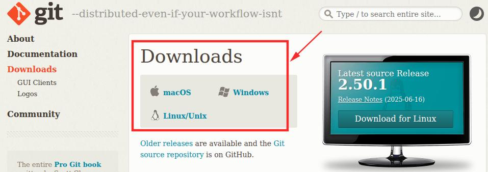
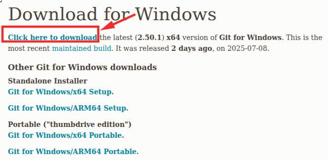

+++
date = '2025-07-10 12:00:25'
title = 'Git安装'
description = ""
categories = ['文档']
showAuthor = false
authors = ["Gu-f"]
weight = 2
+++

## 安装Git版本控制

Git 是一个免费开源的分布式版本控制系统，由 Linus Torvalds 于 2005 年创建，主要用于代码版本管理，当然也可以用于其他任何文本类型的管理，如小说等等。  
为了便于管理维护各个提交者贡献的内容，同时由于我们托管到Git仓库，所以我们需要使用Git。  
如果你知道Git是什么，或者是已经在用/会用Git了，那么你完全可以跳过该步骤。

## Git下载/安装

Git官方下载地址：[Git](https://git-scm.com/downloads)

选择适合你的操作系统进行下载:  
对于Windows系统，你将会下载安装包 - 请点击红框中的Windows。  
对于Linux 和 MacOS，将会提示你如何使用命令行下载 - 请点击红框中对应的。

如果你是Windows系统，你点进去Windows后，你的下载页面应该长这个样子（英文不好也没关系，使用翻译软件可以给你助力）。

然后我们点击红框中的 Click here to download
接下来你会有一个漫长的下载过程，如果你网速慢的情况下。耐心等待下载完成！

下载完成后，双击打开，按照提示进行一步一步安装，如果你看不懂英文，翻译软件是个好东西，它可以帮助你看明白。

安装完成后，我们打开终端控制台:  
对于Windows： 使用快捷键Win+R，然后弹出框中输出cmd，然后回车，即可打开。（Win键就是键盘上带有微软logo的那个案件，一个旗子形状）  
对于Linux: 使用Ctrl+Alt+T键可以直接打开。  
对于MacOS：使用Command(⌘) + Space 键，然后输入Terminal，然后回车，即可打开。

打开控制台后，我们输入`git`然后按回车，如果有输出则安装完成，如果提示没有找到命令或不是内部或外部命令，这说明没有安装成功，或环境变量没有配置。  
对于失败的情况，建议重复上述安装过程。对于Windows系统安装过程中如果有出现是否添加到环境变量，则需要打钩选择。

至此，Git安装完成。

恭喜你安装完成！    

